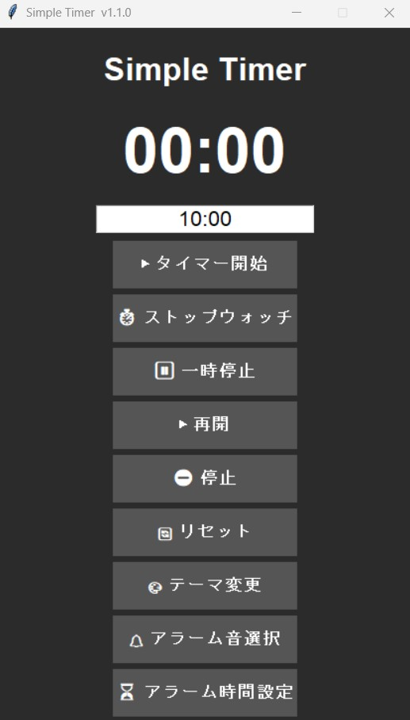

  

# 🕒 Simple Timer

A simple and easy-to-use timer application for Windows.

## ✨ Features

* ⏱ Easy-to-use timer
* 🌙 Dark Theme
* 🎵 Alarm sound when the timer finishes
* ⚡ Lightweight and fast
* 💻 Windows desktop application

## 📸 Screenshot

## 📦 Installation

1. Download the latest installer from the Releases page.
2. Run **SimpleTimer_Setup_v1.1.exe**.
3. Follow the installation wizard.

## 🚀 How to Use

1. Set the desired time.
2. Press **Start**.
3. Wait until the timer finishes.
4. An alarm will notify you when time is up.

## 💻 Requirements

* Windows 10 / Windows 11

## 📄 License

This project is licensed under the MIT License.

## 👨‍💻 Author

Created by **Matsuri-code**

## 🔄 Version

Current Version: **v1.1**
## ☕ Support

If you enjoy using **Simple Timer**, you can support future development here:

☕ https://ko-fi.com/matsuricode

Thank you for your support!

